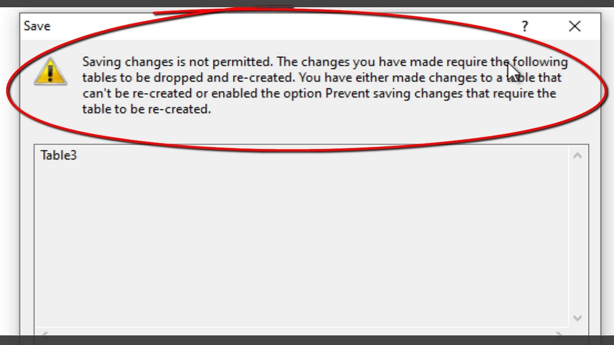

## 🏗️ 1. DDL (Data Definition Language)

**DDL (Data Definition Language)**, veritabanı yapısını tanımlamak için kullanılır.  
Yeni **veritabanı**, **tablo**, **index**, **view** gibi nesneler oluşturabilir; bunları değiştirebilir veya silebilirsiniz.  

DDL komutları veriyle değil, **veri yapısıyla** ilgilenir.  
Yani “hangi verinin nasıl tutulacağını” tanımlar.

---

### 🔹 CREATE
Yeni bir **veritabanı** veya **tablo** oluşturur.

```sql
CREATE DATABASE OrnekDB;

CREATE TABLE Ogrenciler (
    OgrenciID INT PRIMARY KEY,
    Ad NVARCHAR(50),
    Soyad NVARCHAR(50),
    DogumTarihi DATE
);
```

Görmüş olduğunuz gibi yukarıda tablo yaratırken her bir sütun için yanına **veri tipini (data type)** veriyoruz.  
Ayrıca `OgrenciID` sütununu **Primary Key (PK)** olarak tanımlayıp bu sütun sayesinde her bir satırın **eşsiz (unique)** olmasını sağlıyoruz.

| Veri Tipi | Açıklama | Örnek |
|------------|-----------|--------|
| `INT` | Tam sayılar | 1, 2, 3 |
| `FLOAT` / `DECIMAL` | Ondalıklı sayılar | 3.14 |
| `NVARCHAR(n)` | Karakter dizisi (Unicode destekli) | ‘Deniz’ |
| `DATE` | Tarih değeri | 2025-10-23 |
| `BIT` | Boolean değer (0 veya 1) | 1 |

---

🔹 **NOT – Tabloyu manuel düzenleme:**  
Yaratılan tablonun **içeriğini (verilerini)** düzenlemek için:  
- SSMS sol panelde tablonun üzerine sağ tıklayın,  
- “**Edit Top 200 Rows**” seçeneğini seçin.  
Bu ekranda tabloya ait ilk 200 satır düzenlenebilir.

Tablonun **verilerini görüntülemek** için:
- “**Select Top 1000 Rows**” seçeneğini seçebilirsiniz.  
Bu komut, tablonun tuttuğu ilk 1000 satırı `SELECT * FROM ...` sorgusuyla getirir.

---

🔹 **NOT – Design ekranında tablo düzenleme:**  
Bir tabloyu yarattıktan sonra **Design (Tasarım)** kısmından sütun ekleyip silebilirsiniz.  
Ancak bazen SQL Server bunu engelleyebilir ve aşağıdaki hata çıkabilir:



Bu hatayı çözmek için:

1. Üst menüden **Tools → Options** yolunu izleyin  
2. Açılan pencerede:  
   **Designers → Table and Database Designers** sekmesine gidin  
3. “**Prevent saving changes that require table re-creation**” seçeneğinin **işaretini kaldırın**  
4. **OK** butonuna basın  

✅ Artık tablonuzu düzenleyebilir veya yeniden kaydedebilirsiniz.

---

### 🔹 ALTER
Var olan bir tabloyu **değiştirmek** için kullanılır.

```sql
ALTER TABLE Ogrenciler
ADD Email NVARCHAR(100);
```

Yukarıdaki komut ile `Ogrenciler` tablosuna `Email` adında yeni bir sütun eklenmiştir.

Ek olarak:

```sql
ALTER TABLE Ogrenciler
ALTER COLUMN Ad NVARCHAR(100);  -- Veri tipi değiştirme
```

veya

```sql
ALTER TABLE Ogrenciler
DROP COLUMN Email;  -- Sütun silme
```

> 💡 `ALTER` sayesinde tablo yapısına ekleme, silme veya veri tipi değiştirme gibi işlemler yapabilirsiniz.  
> Bu tür değişiklikler **DDL kapsamında** olduğundan otomatik commit edilir (geri alınamaz).

---

### 🔹 DROP
Bir tabloyu veya veritabanını **tamamen siler**.  
Bu komut kullanıldığında tablo veya veritabanı geri alınamaz.

```sql
DROP TABLE Ogrenciler;
```

```sql
DROP DATABASE OrnekDB;
```

> ⚠️ **Dikkat:** DROP komutu tabloyu sadece boşaltmaz, **yapısını da siler.**  
> Bu yüzden, yanlış tabloyu silmemek için önce `SELECT * FROM sys.tables;` ile mevcut tabloları kontrol etmek iyi bir pratiktir.

---

### 🔹 TRUNCATE
Tablonun **yapısını korur** ama **tüm verilerini siler.**  
Bir çeşit “tabloyu sıfırlama” işlemidir.

```sql
TRUNCATE TABLE Ogrenciler;
```

> 💡 TRUNCATE işlemi sonrasında **Primary Key (Identity)** sütunları **yeniden 1’den başlar.**  
> Yani eğer `OgrenciID` sütununu Identity olarak tanımladıysanız, TRUNCATE sonrası tekrar 1’den başlar.

---

### 🔹 DDL Komutlarının Özellikleri

| Özellik | Açıklama |
|----------|-----------|
| **Otomatik commit edilir** | DDL işlemleri geri alınamaz |
| **Yapı (schema) üzerinde çalışır** | Verinin kendisini değil, tablonun yapısını değiştirir |
| **Yönetici yetkisi gerektirebilir** | `CREATE`, `ALTER`, `DROP` komutları için admin yetkisi gerekebilir |
| **Veri kaybı riski vardır** | Özellikle `DROP` ve `TRUNCATE` kalıcı olarak veri siler |

---

🧠 **Ek Bilgi:**  
SSMS üzerinden yapılan `CREATE`, `ALTER` veya `DROP` işlemleri arka planda **T-SQL (Transact-SQL)** komutlarına dönüştürülür.  
Yani SSMS’te tabloyu sürükle-bırak yöntemiyle oluşturduğunuzda bile aslında SQL kodu çalışır.

---

> 💡 **Özetle:**  
> - DDL komutları veri yapısını tanımlar veya değiştirir.  
> - CREATE → Oluşturur  
> - ALTER → Değiştirir  
> - DROP → Siler  
> - TRUNCATE → Veriyi sıfırlar (yapıyı korur)  
>  
> Bu işlemler otomatik olarak commit edilir ve **geri alınamaz.**

## 🧱 2. Northwind Türkçe Veritabanını SSMS Üzerinde Kurma

Artık SQL komutlarını pratikte uygulayabilmek için örnek bir veritabanına ihtiyacımız var.  
Bu derslerde kullanacağımız örnek veritabanı **Northwind Türkçe versiyonudur.**

Northwind, bir toptan satış yapan şirketin müşteri, ürün, sipariş ve çalışan verilerini içeren **örnek bir ticari veritabanıdır.**  
Bu sayede SQL komutlarını gerçek bir veri yapısı üzerinde denememiz mümkün olacak.

---

### 🔹 2.1. Northwind Veritabanını İndirme

📥 Aşağıdaki bağlantıya tıklayarak Northwind Türkçe sürümünü indirin:

> 🔗 [https://www.gencayyildiz.com/blog/northwind-turkce-versiyonu/](https://www.gencayyildiz.com/blog/northwind-turkce-versiyonu/)

Sayfada “**Northwind Veritabanı (Türkçe Versiyon)**” başlıklı kısmı bulup `.zip` veya `.rar` dosyasını indirin.  
İndirme tamamlandıktan sonra:

1. `.rar` dosyasını masaüstüne çıkarın  
2. İçinde `NORTHWND_TR.sql` adında bir dosya göreceksiniz  
3. Bu dosyayı SSMS üzerinde çalıştıracağız

---

### 🔹 2.2. SSMS Üzerinde Dosyayı Açma

1. **SQL Server Management Studio (SSMS)** programını açın  
2. Üst menüden **File → Open → File...** seçeneğini tıklayın  
3. İndirdiğiniz `NORTHWND_TR.sql` dosyasını seçin  
4. Dosya SSMS ekranında yeni bir **sorgu (query)** penceresi olarak açılacaktır

Açılan sorgu genellikle yüzlerce satırdan oluşur.  
Bu kodlar, Northwind veritabanının tablolarını, ilişkilerini ve başlangıç verilerini oluşturur.

---

### 🔹 2.3. Sorguyu Çalıştırma (Execute)

Sorgu penceresinin üst kısmındaki **“Execute”** butonuna tıklayın  
veya klavyeden **F5** tuşuna basın.

Sorgu çalışmaya başlayacak ve tablo yapıları oluşturulacaktır.  
Bazı bilgisayarlarda aşağıdaki gibi hatalar görülebilir:

```
Msg 2714, Level 16, State 6, Line 1
There is already an object named '...' in the database.
```

> 💡 Bu tarz hatalar genellikle önceden aynı tablo isimlerinin bulunmasından kaynaklanır.  
> Endişelenmeyin — sorgu kısmen hata verse bile veritabanı büyük oranda oluşturulur.

---

### 🔹 2.4. Oluşan Veritabanını Görmek

Sorgu tamamlandıktan sonra sol taraftaki **Object Explorer** panelinde **Databases** klasörünü göreceksiniz.

Burada genellikle aşağıdaki gibi bir yapı vardır:

```
Databases
 ┣ master
 ┣ model
 ┣ msdb
 ┣ tempdb
 ┗ Northwind
```

Burada ilk dört veritabanı, **SQL Server’ın sistem (default) veritabanlarıdır.**

---

### 🧩 2.5. Sistem Veritabanlarını Tanıyalım

| Veritabanı | Açıklama |
|-------------|-----------|
| **master** | Tüm veritabanlarının ve sistem yapılandırmalarının kayıtlı olduğu **ana yönetim veritabanıdır.** Sunucu yeniden başlatıldığında ilk yüklenen veritabanıdır. |
| **model** | Yeni oluşturulan tüm veritabanlarının **şablonudur.** Yani siz `CREATE DATABASE` dediğinizde, yeni veritabanı `model` veritabanının bir kopyası olarak oluşur. |
| **msdb** | Zamanlanmış görevler (SQL Agent Jobs), yedekleme geçmişi, log kayıtları gibi **sistemsel işlemlerin** kaydedildiği veritabanıdır. |
| **tempdb** | Geçici tablolar, sorgu sonuçları ve sıralama işlemleri için kullanılan **geçici (temporary)** bir veritabanıdır. Sunucu her açıldığında sıfırdan yeniden oluşturulur. |

> 💡 **Northwind**, bu dört sistem veritabanına **ek olarak sonradan yüklediğimiz kullanıcı veritabanıdır.**  
> Yani biz kendi oluşturduğumuz veya yüklediğimiz tüm veritabanlarını sisteminkilerin **altına ekleriz.**

---

### 🔹 2.6. Refresh (Yenileme) İşlemi

Northwind veritabanı sorgusu tamamlandıktan sonra veritabanı listede hemen görünmeyebilir.  
Bunun için:

1. Sol paneldeki **Databases** klasörüne sağ tıklayın  
2. **Refresh (Yenile)** seçeneğini tıklayın  

Artık listede **Northwind** adlı yeni bir veritabanı görünecektir ✅

---

### 🔹 2.7. Kurulumu Kontrol Etme

Northwind veritabanının doğru şekilde eklendiğini doğrulamak için:

1. **Northwind → Tables** klasörünü genişletin  
2. `Musteriler`, `Calisanlar`, `Urunler`, `Siparisler`, `Kategoriler` gibi tablolar listeleniyorsa kurulum başarıyla tamamlanmıştır.

Alternatif olarak aşağıdaki sorguyu da çalıştırabilirsiniz:

```sql
USE Northwind;
SELECT * FROM sys.tables;
```

Bu komut, Northwind veritabanındaki tüm tablo isimlerini listeler.

---

### 🔹 2.8. Sık Karşılaşılan Durumlar

| Durum | Açıklama |
|--------|-----------|
| Hata mesajı çıktı ama veritabanı oluşturuldu | Sorun yok, “Refresh” yaptıktan sonra görünür |
| Northwind görünmüyor | “Databases” klasörüne sağ tıklayıp “Refresh” yapın |
| Sorgu çok uzun sürdü | Bilgisayarın performansına göre 1–3 dakika sürebilir |
| Veritabanı adı İngilizce (`NORTHWND`) | Sorun değil, Türkçe sürümde bazı adlar İngilizce kalabilir |
| “Cannot connect to server” hatası | Sunucu ismi yanlış girilmiş olabilir (`.\SQLEXPRESS` veya `localhost` olarak düzeltin) |

---

> 💡 **Özet:**  
> 1️⃣ Northwind dosyasını indirin  
> 2️⃣ `.rar`dan çıkarın  
> 3️⃣ SSMS’te açın  
> 4️⃣ Execute (F5) ile çalıştırın  
> 5️⃣ Refresh yaparak veritabanının eklendiğini kontrol edin  
>  
> Artık Northwind veritabanı başarıyla yüklendi! 🎉 
> Bundan sonraki derslerde tüm DQL ve DML komutlarını bu veritabanı üzerinde uygulayacağız.
