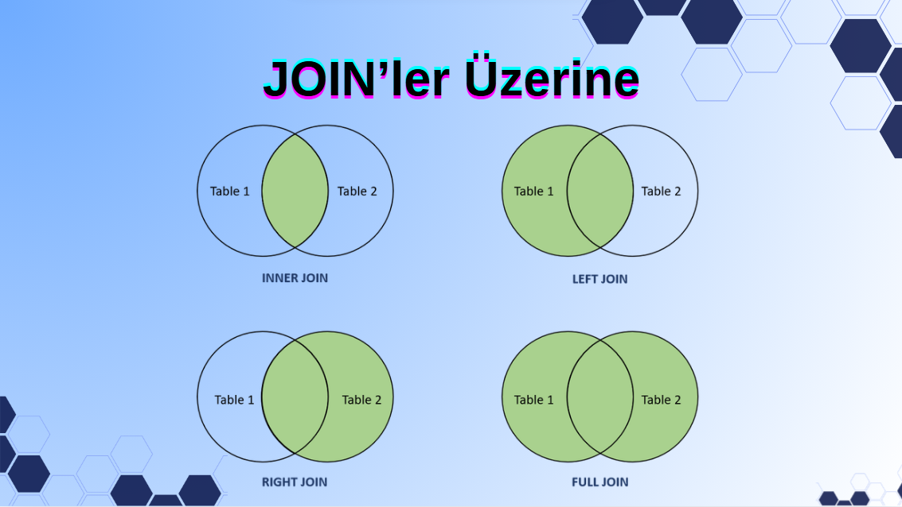

# 🔗 SQL JOIN’LER

İlişkisel veritabanlarında veriler tek bir tabloda tutulmaz; anlamlı şekilde **parçalanır** ve birbirine **ilişkiler** üzerinden bağlanır.  
Bu nedenle farklı tablolardaki bilgileri tek bir sonuç kümesinde toplamak için **JOIN** yapıları kullanılır.

Bu doküman, SQL JOIN kavramını **neden kullanıyoruz → nasıl çalışır → join türleri → örnek uygulamalar** akışıyla anlatır.

# ⭐ 1. JOIN’lere Neden İhtiyaç Duyuyoruz?

İlişkisel veritabanlarında **normalizasyon** gereği veri tekrarını azaltmak için bilgiler farklı tablolara dağıtılır:

- Müşteriler bir tabloda  
- Siparişler başka bir tabloda  
- Ürünler ayrı bir tabloda  
- Sipariş detayları farklı bir tabloda  

Tek bir tabloya bakarak gerçek iş bilgisini göremeyiz.

Örneğin:
- “Hangi müşteri hangi ürünü sipariş etti?”
- “Siparişin toplam tutarı nedir?”
- “Bu siparişi hangi çalışan aldı?”
- “Hangi ürün hangi kategoriye ait?”

Bu soruların cevapları **birden fazla tablonun birleşmesini gerektirir**.

📌 **JOIN’in temel amacı**:  
> Parçalanmış veriyi ilişkisel bağ üzerinden bir araya getirip anlamlı tek bir sonuç üretmek.

---

# ⭐ 2. JOIN Nedir? (Temel Mantık)

JOIN, iki veya daha fazla tabloyu, genellikle bir **birincil anahtar (PK)** ile bir **yabancı anahtar (FK)** arasındaki ilişkiye göre birleştirir.

Örnek ilişki:
Musteriler.MusteriID = Siparisler.MusteriID

Bu ilişki jüri gibi davranır:
- “Bu müşteri ile bu sipariş eşleşiyor mu?”  
- “Eşleşiyorsa aynı satırda göster.”  

JOIN sorguları bu mantıkla çalışır.

---
# ⭐ 3. JOIN Türleri – Kavramsal Anlatım

JOIN türleri aslında “hangi verileri dahil edeceğiz?” sorusuna verilen cevaptır.  
Her JOIN farklı bir kapsamı temsil eder.



---

# 🧩 1. INNER JOIN – *“Sadece eşleşenleri getir”*

## 📘 Mantık
Her iki tabloda da karşılığı olan (kesişen) kayıtlar döner.  
Bir tabloda olup diğerinde olmayan kayıtlar göz ardı edilir.

## 🎓 Northwind Örneği
```sql
SELECT S.SiparisID, M.SirketAdi
FROM Siparisler S
INNER JOIN Musteriler M
    ON S.MusteriID = M.MusteriID;
```
✔ Sadece sipariş veren müşteriler gelir.
✖ Sipariş vermemiş müşteriler listeye alınmaz.